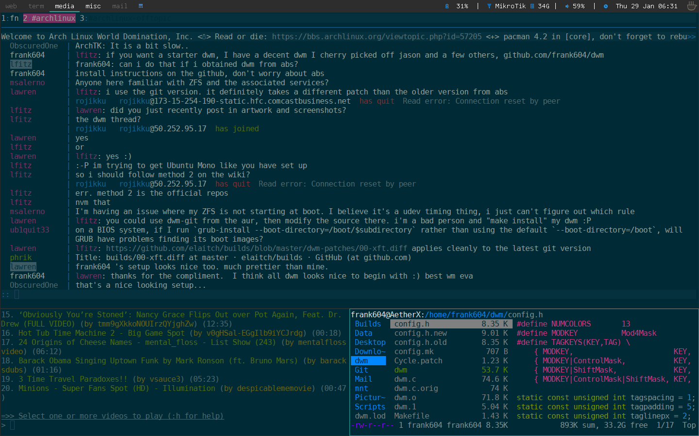

Taken from git clone https://github.com/KieranQuinn/dwm.git
Then Applied cycle and push patch (modified from jasonwryan's bitbucket to patch on this dwm set.
Fixed dwm.c to fix some previous errors that disabled runorraise.

Source
-----------
https://github.com/frank604/dwm.git

Requirements
------------
* Xlib header files
* tamsynmod font

Instructions
------------

    git clone https://github.com/KieranQuinn/dwm.git
    cd dwm && sudo make clean install
    
Status Bar
----------

    You will need dwm-start and dwm-statusbar from my scripts repo.
    In ~/.xinitrc:
    exec $HOME/path/to/script/dwm-start

Patches/Features
----------------
* statuscolors
* statusallmons
* centredfloating
* savefloats
* notitle
* pertag2
* systray
* occupiedcol
* uselessgaps
* keysymfix
* bstack
* runorraise
* Push
* Cycle

