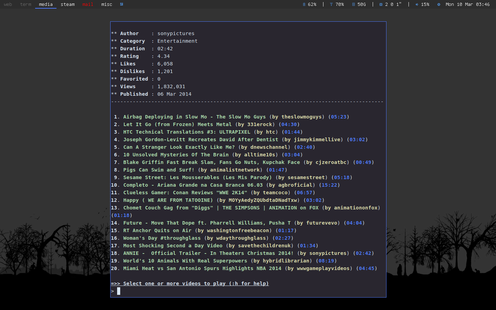

# Taken from git clone https://github.com/KieranQuinn/dwm.git
# Then Applied cycle and push patch (modified from jasonwryan's 
# bitbucket to patch on this dwm set.

Requirements
------------
* Xlib header files
* ohsnap font

Instructions
------------

    git clone https://github.com/KieranQuinn/dwm.git
    cd dwm && sudo make clean install
    
    
Patches/Features
----------------
* statuscolors
* statusallmons
* centredfloating
* savefloats
* notitle
* pertag2
* systray
* occupiedcol
* uselessgaps
* keysymfix
* bstack
* runorraise
* Push
* Cycle

New/Fixes
---
* re-wrote drawbar
* selected tag underline (configurable via config.h)
* tag spacing & padding (configurable via config.h)
* bstack horizonal gaps
    
To do
-----
* monocle gaps?
* fix monocle to tile layout/resizing
    
Screenshot
----------

